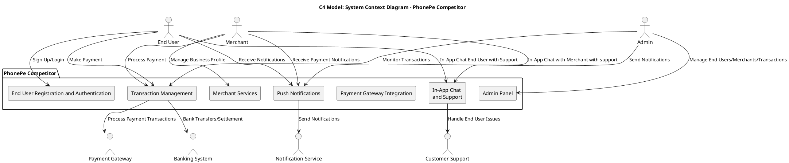
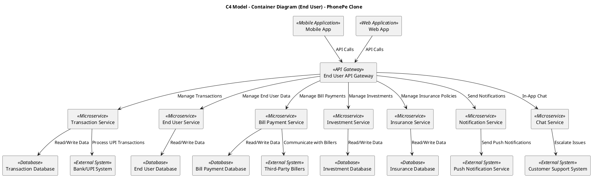
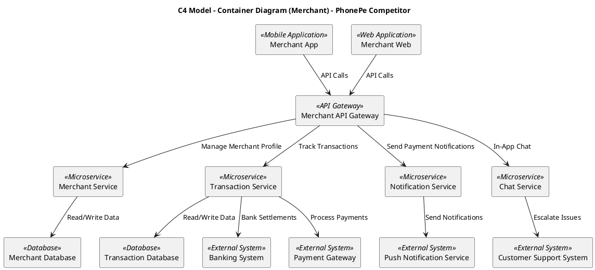
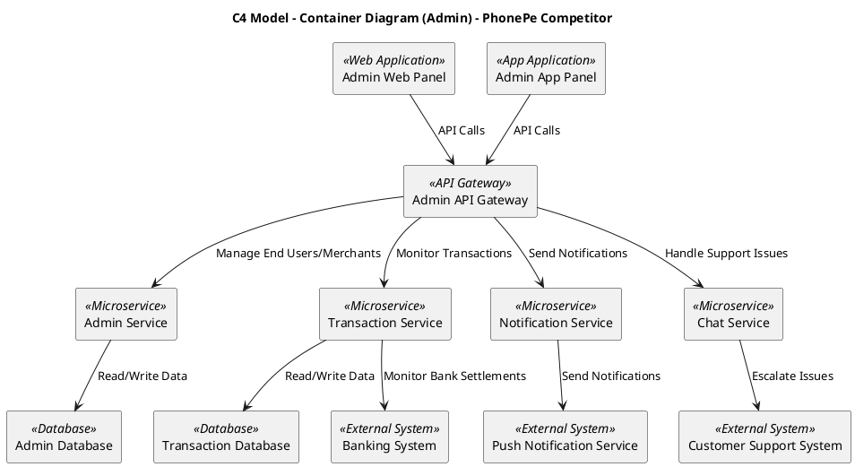
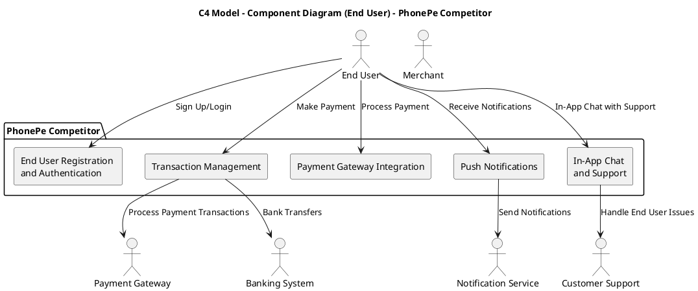
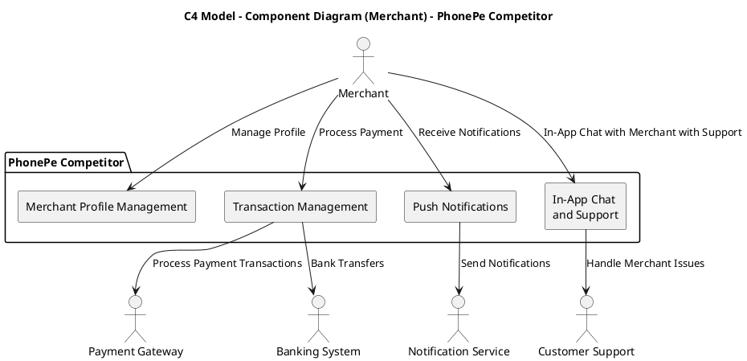
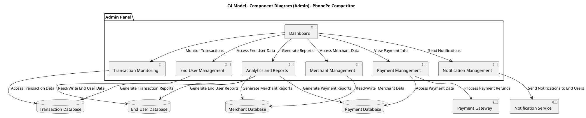
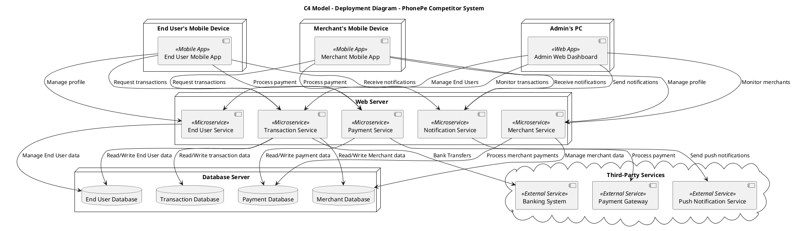

# 7.1 : System Context  Diagram Code

# Container Diagram
## 7.2 : End User

## 7.3 : Merchant

## 7.4 : Admin

# Component Diagram
## 7.5 : End User

## 7.6 : Merchant

## 7.7 : Admin

# 7.8 : Deployment Diagram Code

