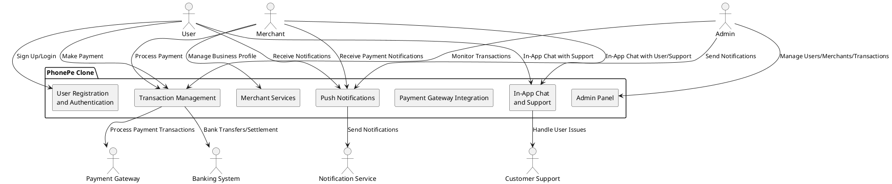
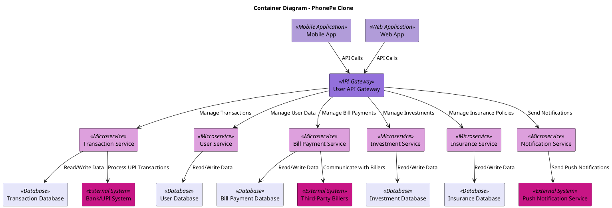
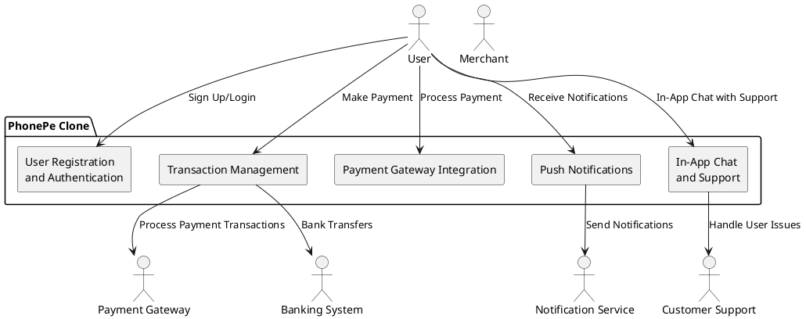
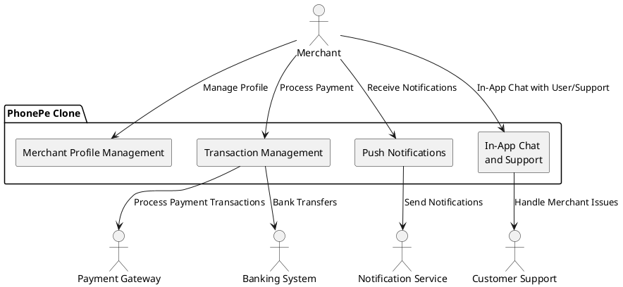
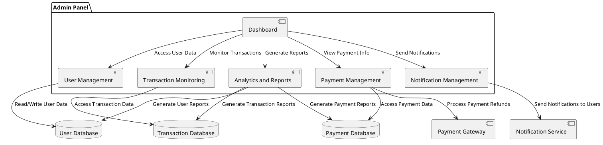
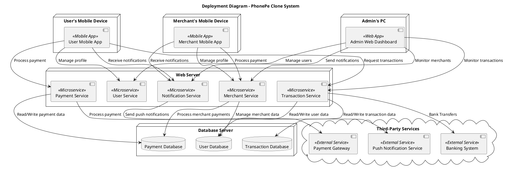

# System Context  Diagram Code

```plantuml
@startuml

    ' External Actors
    actor "User" as User
    actor "Merchant" as Merchant
    actor "Admin" as Admin
    actor "Payment Gateway" as PaymentGateway
    actor "Notification Service" as NotificationService
    actor "Customer Support" as CustomerSupport
    actor "Banking System" as BankingSystem

    ' System Boundary: PhonePe Clone
    package "PhonePe Clone" {

        ' Subsystems
        rectangle "User Registration \nand Authentication" as Registration
        rectangle "Transaction Management" as TransactionManagement
        rectangle "Payment Gateway Integration" as PaymentGatewayIntegration
        rectangle "Merchant Services" as MerchantServices
        rectangle "Push Notifications" as PushNotifications
        rectangle "In-App Chat \nand Support" as ChatSupport
        rectangle "Admin Panel" as AdminPanel
    }

    ' Relationships between actors and system components
    User --> Registration : Sign Up/Login
    User --> TransactionManagement : Make Payment
    User --> PushNotifications : Receive Notifications
    User --> ChatSupport : In-App Chat with Support

    Merchant --> TransactionManagement : Process Payment
    Merchant --> MerchantServices : Manage Business Profile
    Merchant --> PushNotifications : Receive Payment Notifications
    Merchant --> ChatSupport : In-App Chat with User/Support

    Admin --> AdminPanel : Manage Users/Merchants/Transactions
    Admin --> TransactionManagement : Monitor Transactions
    Admin --> PushNotifications : Send Notifications

    ' External Interactions
    TransactionManagement --> PaymentGateway : Process Payment Transactions
    PushNotifications --> NotificationService : Send Notifications
    ChatSupport --> CustomerSupport : Handle User Issues
    TransactionManagement --> BankingSystem : Bank Transfers/Settlement

@enduml
```

# Container Diagram
## User

```plantuml
## Merchant

 @startuml
!define RECTANGLE rectangle
!define BOLD **<color:Black>**

title Container Diagram - PhonePe Clone

' Add primary containers
' User-facing applications
RECTANGLE "Mobile App" as mobileApp <<Mobile Application>> #b19cd9
RECTANGLE "Web App" as webApp <<Web Application>> #b19cd9
RECTANGLE "User API Gateway" as userGateway <<API Gateway>> #9370db

' Backend services
RECTANGLE "Transaction Service" as transactionService <<Microservice>> #dda0dd
RECTANGLE "User Service" as userService <<Microservice>> #dda0dd
RECTANGLE "Bill Payment Service" as billService <<Microservice>> #dda0dd
RECTANGLE "Investment Service" as investmentService <<Microservice>> #dda0dd
RECTANGLE "Insurance Service" as insuranceService <<Microservice>> #dda0dd
RECTANGLE "Notification Service" as notificationService <<Microservice>> #dda0dd

' Database containers
RECTANGLE "Transaction Database" as transactionDB <<Database>> #e6e6fa
RECTANGLE "User Database" as userDB <<Database>> #e6e6fa
RECTANGLE "Bill Payment Database" as billDB <<Database>> #e6e6fa
RECTANGLE "Investment Database" as investmentDB <<Database>> #e6e6fa
RECTANGLE "Insurance Database" as insuranceDB <<Database>> #e6e6fa

' External systems
RECTANGLE "Bank/UPI System" as bankSystem <<External System>> #c71585
RECTANGLE "Third-Party Billers" as billers <<External System>> #c71585
RECTANGLE "Push Notification Service" as pushNotification <<External System>> #c71585

' Relationships between containers
mobileApp --> userGateway : "API Calls"
webApp --> userGateway : "API Calls"
userGateway --> transactionService : "Manage Transactions"
userGateway --> userService : "Manage User Data"
userGateway --> billService : "Manage Bill Payments"
userGateway --> investmentService : "Manage Investments"
userGateway --> insuranceService : "Manage Insurance Policies"
userGateway --> notificationService : "Send Notifications"

transactionService --> transactionDB : "Read/Write Data"
userService --> userDB : "Read/Write Data"
billService --> billDB : "Read/Write Data"
investmentService --> investmentDB : "Read/Write Data"
insuranceService --> insuranceDB : "Read/Write Data"

transactionService --> bankSystem : "Process UPI Transactions"
billService --> billers : "Communicate with Billers"
notificationService --> pushNotification : "Send Push Notifications"

@enduml

```
## Admin

# Component Diagram
## User

```plantuml
@startuml

' External Actors
actor "User" as User
actor "Merchant" as Merchant
actor "Payment Gateway" as PaymentGateway
actor "Notification Service" as NotificationService
actor "Customer Support" as CustomerSupport
actor "Banking System" as BankingSystem

' System Boundary: PhonePe Clone
package "PhonePe Clone" {

    ' Subsystems related to User
    rectangle "User Registration \nand Authentication" as UserRegistration
    rectangle "Transaction Management" as UserTransactionManagement
    rectangle "Payment Gateway Integration" as UserPaymentGatewayIntegration
    rectangle "Push Notifications" as UserPushNotifications
    rectangle "In-App Chat \nand Support" as UserChatSupport
}

' Relationships between User and system components
User --> UserRegistration : Sign Up/Login
User --> UserTransactionManagement : Make Payment
User --> UserPaymentGatewayIntegration : Process Payment
User --> UserPushNotifications : Receive Notifications
User --> UserChatSupport : In-App Chat with Support

' External Interactions
UserTransactionManagement --> PaymentGateway : Process Payment Transactions
UserPushNotifications --> NotificationService : Send Notifications
UserChatSupport --> CustomerSupport : Handle User Issues
UserTransactionManagement --> BankingSystem : Bank Transfers

@enduml
```
## Merchant

```plantuml
@startuml

' External Actors
actor "Merchant" as Merchant
actor "Payment Gateway" as PaymentGateway
actor "Notification Service" as NotificationService
actor "Customer Support" as CustomerSupport
actor "Banking System" as BankingSystem

' System Boundary: PhonePe Clone
package "PhonePe Clone" {

    ' Subsystems related to Merchant
    rectangle "Merchant Profile Management" as MerchantProfile
    rectangle "Transaction Management" as MerchantTransactionManagement
    rectangle "Push Notifications" as MerchantPushNotifications
    rectangle "In-App Chat \nand Support" as MerchantChatSupport
}

' Relationships between Merchant and system components
Merchant --> MerchantProfile : Manage Profile
Merchant --> MerchantTransactionManagement : Process Payment
Merchant --> MerchantPushNotifications : Receive Notifications
Merchant --> MerchantChatSupport : In-App Chat with User/Support

' External Interactions
MerchantTransactionManagement --> PaymentGateway : Process Payment Transactions
MerchantPushNotifications --> NotificationService : Send Notifications
MerchantChatSupport --> CustomerSupport : Handle Merchant Issues
MerchantTransactionManagement --> BankingSystem : Bank Transfers

@enduml
```
## Admin

```plantuml
@startuml

' Define the system components for the Admin Panel
package "Admin Panel" {
    component "Dashboard" as Dashboard
    component "User Management" as UserManagement
    component "Transaction Monitoring" as TransactionMonitoring
    component "Payment Management" as PaymentManagement
    component "Analytics and Reports" as AnalyticsReports
    component "Notification Management" as NotificationManagement
}

' External services used by the Admin Panel
database "User Database" as UserDB
database "Transaction Database" as TransactionDB
database "Payment Database" as PaymentDB
component "Notification Service" as NotificationService
component "Payment Gateway" as PaymentGateway

' Relationships between Admin Panel components
Dashboard --> UserManagement : Access User Data
Dashboard --> TransactionMonitoring : Monitor Transactions
Dashboard --> PaymentManagement : View Payment Info
Dashboard --> AnalyticsReports : Generate Reports
Dashboard --> NotificationManagement : Send Notifications

' Internal component interactions
UserManagement --> UserDB : Read/Write User Data
TransactionMonitoring --> TransactionDB : Access Transaction Data
PaymentManagement --> PaymentDB : Access Payment Data
AnalyticsReports --> UserDB : Generate User Reports
AnalyticsReports --> TransactionDB : Generate Transaction Reports
AnalyticsReports --> PaymentDB : Generate Payment Reports

' External interactions
PaymentManagement --> PaymentGateway : Process Payment Refunds
NotificationManagement --> NotificationService : Send Notifications to Users

@enduml
```

# Deployment Diagram Code

```plantuml
@startuml
title Deployment Diagram - PhonePe Clone System

node "User's Mobile Device" {
    [User Mobile App] <<Mobile App>>
}

node "Merchant's Mobile Device" {
    [Merchant Mobile App] <<Mobile App>>
}

node "Admin's PC" {
    [Admin Web Dashboard] <<Web App>>
}

node "Web Server" {
    [Transaction Service] <<Microservice>>
    [User Service] <<Microservice>>
    [Payment Service] <<Microservice>>
    [Merchant Service] <<Microservice>>
    [Notification Service] <<Microservice>>
}

node "Database Server" {
    database "User Database" as UserDB
    database "Transaction Database" as TransactionDB
    database "Payment Database" as PaymentDB
}

cloud "Third-Party Services" {
    [Payment Gateway] <<External Service>>
    [Push Notification Service] <<External Service>>
    [Banking System] <<External Service>>
}

' Connections
[User Mobile App] --> [Transaction Service] : "Request transactions"
[User Mobile App] --> [Payment Service] : "Process payment"
[User Mobile App] --> [Notification Service] : "Receive notifications"
[User Mobile App] --> [User Service] : "Manage profile"

[Merchant Mobile App] --> [Merchant Service] : "Process payment"
[Merchant Mobile App] --> [Notification Service] : "Receive notifications"
[Merchant Mobile App] --> [Merchant Service] : "Manage profile"

[Admin Web Dashboard] --> [Transaction Service] : "Monitor transactions"
[Admin Web Dashboard] --> [User Service] : "Manage users"
[Admin Web Dashboard] --> [Merchant Service] : "Monitor merchants"
[Admin Web Dashboard] --> [Notification Service] : "Send notifications"

[Transaction Service] --> UserDB : "Read/Write user data"
[Payment Service] --> PaymentDB : "Read/Write payment data"
[Merchant Service] --> UserDB : "Manage merchant data"
[Merchant Service] --> PaymentDB : "Process merchant payments"
[Transaction Service] --> TransactionDB : "Read/Write transaction data"

[Payment Service] --> [Payment Gateway] : "Process payment"
[Notification Service] --> [Push Notification Service] : "Send push notifications"
[Transaction Service] --> [Banking System] : "Bank Transfers"

@enduml
```
