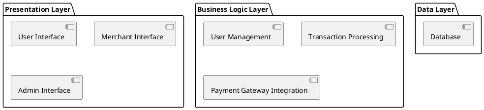

# Software Design Document for PhonePe Application

## Title Page

*Project Title:* PhonePe Application Design Document  
*Authors:* [CSITTeam014]  
*Version:* 1.0  
*Date:* [05-12-2024]  
 

---

## Table of Contents

1. Introduction
2. System Architecture
3. Functional Requirements and Design Components
4. Non-Functional Requirements and Design Components
5. Data Design
6. Interface Design
7. Error Handling and Recovery
8. Assumptions and Dependencies
9. Glossary
10. References

---

## 1. Introduction

The PhonePe application is a digital payment platform that enables users to perform various financial transactions, such as sending money, paying bills, and recharging mobile phones. This document outlines the design of the PhonePe application in accordance with IEEE standards, detailing both functional and non-functional requirements.

### Purpose of the Document

The purpose of this Software Design Document (SDD) is to provide a comprehensive guide for developers, stakeholders, and project managers involved in the PhonePe application development process.

### Intended Audience

- Developers
- Project Managers
- Quality Assurance Team
- Stakeholders

---

## 2. System Architecture

The architecture of the PhonePe application consists of three main layers: Presentation Layer, Business Logic Layer, and Data Layer.




## 3. Functional Requirements and Design Components

1. *Register*
   - *Actor:* User
   - *Precondition:* None
   - *Description:* Create an account to access the app's features.
   - *Design Component:* User Registration Module
     - Handles input validation, user data storage, and account creation.


   ```plantuml
   @startuml
   component "User Registration Module" {
       + validateInput()
       + storeUserData()
       + createAccount()
   }
   @enduml
   ```
   

1. *Login*
   - *Actor:* User
   - *Precondition:* Must have an existing account.
   - *Description:* Access the app and its features.
   - *Design Component:* Authentication Module
     - Manages user login sessions, credential verification, and security measures.


     
   ```plantuml
   @startuml
   component "Authentication Module" {
       + verifyCredentials()
       + startSession()
       + endSession()
   }
   @enduml
   ```
   

1. *Add Money to Wallet*
   - *Actor:* User
   - *Precondition:* Must have a linked payment method.
   - *Description:* Add funds to their digital wallet.
   - *Design Component:* Wallet Management Module
     - Facilitates linking payment methods and processing deposits.
    
 

     
   ```plantuml
   @startuml
   component "Wallet Management Module" {
       + linkPaymentMethod()
       + processDeposit()
       + updateWalletBalance()
   }
   @enduml
   ```
   

2. *Send Money to Contacts*
   - *Actor:* User
   - *Precondition:* Must have sufficient balance in wallet.
   - *Description:* Transfer money to other users.
   - *Design Component:* Transaction Processing Module
     - Manages fund transfers, recipient validation, and transaction authorization.


   ```plantuml
   @startuml
   component "Transaction Processing Module" {
       + validateRecipient()
       + authorizeTransfer()
       + updateTransactionHistory()
   }
   @enduml
   ```
   

2. *Pay Bills*
   - *Actor:* User
   - *Precondition:* Must have linked bank account or wallet balance.
   - *Description:* Pay utility bills through the app.
   - *Design Component:* Bill Payment Module
     - Interfaces with biller APIs for payment processing and confirmation.


  ```plantuml
   @startuml
   component "Bill Payment Module" {
       + selectBiller()
       + processPayment()
       + confirmPayment()
   }
   @enduml
```
   

3. *Recharge Mobile*
   - *Actor:* User
   - *Precondition:* Must have wallet balance.
   - *Description:* Recharge their mobile phone number.
   - *Design Component:* Mobile Recharge Module
     - Handles selection of recharge plans and processes payments.


   ```plantuml
   @startuml
   component "Mobile Recharge Module" {
       + selectRechargePlan()
       + processRecharge()
       + updateMobileBalance()
   }
   @enduml
   ```
   

3. *Book Tickets*
   - *Actor:* User
   - *Precondition:* Must have wallet balance or linked payment method.
   - *Description:* Book tickets for various services.
   - *Design Component:* Ticket Booking Module
     - Manages ticket searches, selections, and payment processing.
     - 


```plantuml 
@startuml 
component "Ticket Booking Module" { 
    + searchTickets() 
    + selectTicket() 
    + processBooking() 
} 
@enduml
```


8. *View Transaction History*
    - *Actor:* User  
    - *Precondition:* Must be logged in  
    - *Description:* Review past transactions  
    - *Design Component:* Transaction History Module  
      - Retrieves and displays past transactions for user review.


```plantuml 
@startuml 
component "Transaction History Module" { 
    + fetchTransactionHistory() 
    + displayTransactions() 
} 
@enduml
```


9. *Raise Dispute*
    - Actor: User  
    - Precondition: Must have made a recent transaction  
    - Description: Dispute a transaction or issue  
    - Design Component: Dispute Management Module  
      - Allows users to submit disputes and tracks their status.


```plantuml 
@startuml 
component "Dispute Management Module" { 
    + submitDispute() 
    + trackDisputeStatus() 
} 
@enduml
```


10. *Accept Payments*
    - Actor: Merchant  
    - Precondition: Must have registered and set up account  
    - Description: Receive digital payments from users  
    - Design Component: Merchant Payment Module  
      - Facilitates payment acceptance through various methods.


```plantuml 
@startuml 
component "Merchant Payment Module" { 
    + enablePaymentMethods() 
    + viewTransactionDetails() 
} 
@enduml
```


11. *View Payment History*
    - Actor: Merchant  
    - Precondition: Must have an active merchant account  
    - Description: Review payment history and details  
    - Design Component: Merchant Dashboard Module  
      - Displays payment history and transaction details for merchants.

plantuml 
@startuml 
component "Merchant Dashboard Module" { 
    + fetchPaymentHistory() 
    + displayPaymentDetails() 
} 
@enduml 


12. *Withdraw Money to Bank Account*
    - Actor: Merchant  
    - Precondition: Must have received payments  
    - Description: Transfer funds to linked bank account  
    - Design Component: Withdrawal Processing Module  
      - Manages withdrawal requests and bank transfer processes.

plantuml 
@startuml 
component "Withdrawal Processing Module" { 
    + initiateWithdrawalRequest() 
} 
@enduml 


13. *Resolve Disputes*
    - Actor: Merchant  
    - Precondition: Must have unresolved disputes  
    - Description: Work with support to resolve payment disputes  
    - Design Component: Dispute Resolution Module  
      - Facilitates communication between merchants and support for dispute resolution.

plantuml 
@startuml 
component "Dispute Resolution Module" { 
    + provideTransactionDetails() 
} 
@enduml 


14. *Manage Users*
     - Actor: Admin        - Precondition: Must have administrative access        - Description: Manage user accounts and permissions        - Design Component: Admin Management Module          - Provides functionalities for creating, modifying, or deactivating user accounts.

plantuml    @startuml    component "Admin Management Module" {        + createUserAccount()        + modifyUserAccount()        + deactivateUserAccount()    }    @enduml     

15. *Generate Reports*
     - Actor: Admin         - Precondition: Administrative access         - Description: Generate various reports based on user activity and transactions         - Design Component: Reporting Module             - Generates reports for analysis.

plantuml     @startuml     component "Reporting Module" {             + generateUserActivityReport()             + generateTransactionReport()     }     @enduml      

---

## 4. Non-Functional Requirements and Design Components

1. *Modularity*
     - Importance Level: C+
     - Design Component: Modular Architecture Framework     

plantuml     @startuml     component "Modular Architecture Framework" {             + defineModules()             + manageModuleDependencies()     }     @enduml      

2. *Maintainability*
     - Importance Level: O           - Design Component: Code Maintenance Guidelines 

plantuml      @startuml  component "Code Maintenance Guidelines" {  + establishCodingStandards()  + documentCodeBase() }  @enduml  

3. *Reusability*
     - Importance Level: O      – Design Component: Shared Libraries/Components 

plantuml      @startuml  component "Shared Libraries/Components" {  + createReusableComponents()  }  @enduml  

4. *Testability*
     - Importance Level: O     – Design Component: Testing Framework Integration 

plantuml      @startuml  component "Testing Framework Integration" {  + implementUnitTests()  + implementIntegrationTests()  }  @enduml  

5. *Documentation*
     - Importance Level: I     – Design Component: Documentation Standards 

plantuml      @startuml  component "Documentation Standards" {  + provideGuidelinesForDocumentation()  }  @enduml  

6. *Error Handling*
     - Importance Level: N/A     – Design Component: Error Handling Framework 

plantuml      @startuml  component "Error Handling Framework" {  + logErrors()  + displayUserFriendlyErrors() }  @enduml  

---

## 5. Data Design

### Database Schema

The database schema will include tables for users, transactions, merchants, and disputes.

plantuml
@startuml
entity "Users" {
    + user_id : int
    + username : string
    + password : string
}

entity "Transactions" {
    + transaction_id : int
    + amount : float
    + date : datetime
}

entity "Merchants" {
    + merchant_id : int
    + name : string
}

entity "Disputes" {
    + dispute_id : int
    + transaction_id : int 
}
@enduml


---

## 6. Interface Design

### User Interface Elements

The user interface will consist of:

- Registration/Login screens with input fields for credentials.
- Dashboard displaying wallet balance and quick action buttons (Send Money, Pay Bills).
- Transaction history page with filters for date and type of transaction.

### Mockups

plantuml
@startuml
skinparam componentStyle rectangle

component "Registration Screen" {
}

component "Login Screen" {
}

component "Dashboard" {
}

component "Transaction History" {
}
@enduml


---

## 7. Error Handling and Recovery

The system will implement robust error handling mechanisms that include:

- Logging errors for debugging purposes.
- Providing user-friendly error messages on the UI.
- Implementing retry mechanisms for failed transactions where applicable.

---

## 8. Assumptions and Dependencies

### Assumptions

- Users will have internet connectivity to access the application.
- Users will provide accurate information during registration.

### Dependencies

- External APIs for payment processing must be available and reliable.
- Database management system must support required operations efficiently.

---

## 9. Glossary

- User: Individual using the PhonePe application for financial transactions.
- Merchant: Business entity receiving payments through the PhonePe application.
- Admin: Administrative user managing the application backend.

---

## 10. References

1. IEEE Std 830-1998 (IEEE Recommended Practice for Software Requirements Specifications)
2. IEEE Std 1016-2009 (IEEE Standard for Software Design Descriptions)

This design document serves as a foundational blueprint for developing the PhonePe application while adhering to industry standards and best practices in software engineering. It provides a clear link between requirements and design components necessary for implementation, ensuring a comprehensive understanding of the system architecture among all stakeholders involved in the project development lifecycle.
