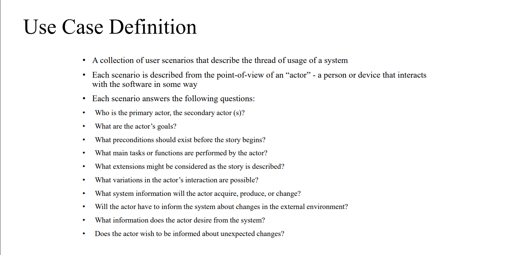
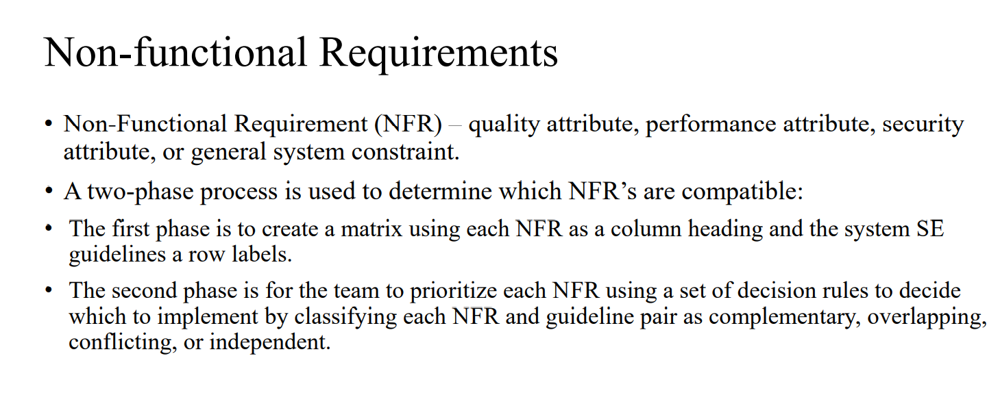

# Software Requirements Specification (SRS) Document

## 1. Introduction

### 1.1 Purpose
This Software Requirements Specification (SRS) document provides a comprehensive overview of the requirements for the PhonePe clone application. It includes both functional and non-functional requirements and serves as a guideline for developers, testers, and stakeholders throughout the software development lifecycle.

### 1.2 Scope
The PhonePe clone application is a mobile-based payment platform that enables users to perform transactions such as money transfers, bill payments, mobile recharges, and merchant payments. The system will handle user registration, payment processing, transaction history, and wallet management. This SRS covers all aspects of the application, including user interfaces, functional and non-functional requirements, and external interface requirements.

### 1.3 Definitions, Acronyms, and Abbreviations
- **SRS**: Software Requirements Specification  
- **NFR**: Non-Functional Requirement  
- **UI**: User Interface  
- **API**: Application Programming Interface  
- **UPI**: Unified Payments Interface  
- **OTP**: One-Time Password  

### 1.4 References
- IEEE Std 830-1998, IEEE Recommended Practice for Software Requirements Specifications  
- SWEBOK v3.0, Software Engineering Body of Knowledge  
- Stakeholders.md  
- User Requirements Document  

### 1.5 Overview
This document is organized into several sections that describe the overall system, functional requirements, non-functional requirements, and other considerations relevant to the development and implementation of the PhonePe clone application.

---

## 2. Overall Description

### 2.1 Product Perspective
The PhonePe clone application is an independent system designed to operate on mobile devices. It interfaces with external systems such as payment gateways, UPI services, and third-party APIs for bill payments and mobile recharges. The system will use a modular architecture to ensure scalability and maintainability.

### 2.2 Product Functions
- User registration and authentication.  
- Wallet management for adding and withdrawing funds.  
- UPI-based money transfers.  
- Bill payments (electricity, water, gas, etc.).  
- Mobile and DTH recharges.  
- Merchant payments using QR codes.  
- Transaction history and analytics.  

### 2.3 User Classes and Characteristics
- **Users**: Individuals using the app to perform financial transactions.  
- **Merchants**: Businesses using the app to accept payments.  
- **Admins**: Individuals managing the platform, overseeing transactions, and ensuring regulatory compliance.  

### 2.4 Operating Environment
The application will operate on Android and iOS mobile platforms. It will require internet connectivity for functionalities like payment processing, UPI transactions, and bill payments. The backend will be hosted on cloud servers with high availability and reliability.

### 2.5 Design and Implementation Constraints
- Must comply with financial regulations (e.g., PCI-DSS, GDPR).  
- Limited by the performance and capabilities of mobile devices.  
- Dependency on third-party services for UPI, bill payments, and mobile recharges.  

### 2.6 Assumptions and Dependencies
- Users have access to smartphones with stable internet connections.  
- Integration with third-party services is stable and reliable.  
- The application will initially support one currency (INR) and language (English).  

---

## 3. System Features

### 3.1 User Registration and Authentication
**Description:** Users can register using their phone numbers. The system supports secure login via OTP.  

**Functional Requirements:**  
- The system shall allow users to register with a valid phone number.  
- The system shall send an OTP for account verification.  
- The system shall support password recovery via OTP.  

---

### 3.2 Wallet Management
**Description:** Users can add money to their wallet using linked bank accounts, debit/credit cards, or UPI.  

**Functional Requirements:**  
- The system shall allow users to add funds to their wallet.  
- The system shall allow users to withdraw money from their wallet to a linked bank account.  
- The system shall display the wallet balance in real-time.  

---

### 3.3 UPI-Based Money Transfers
**Description:** Users can transfer money using UPI IDs or by scanning QR codes.  

**Functional Requirements:**  
- The system shall support linking of bank accounts for UPI transactions.  
- The system shall allow users to send money to other users via UPI IDs or QR codes.  
- The system shall notify users of successful and failed transactions.  

---

### 3.4 Bill Payments and Recharges
**Description:** Users can pay utility bills and recharge mobile numbers or DTH services.  

**Functional Requirements:**  
- The system shall provide a list of billers and support bill payments.  
- The system shall allow users to recharge prepaid mobile and DTH services.  
- The system shall generate receipts for all transactions.  

---

### 3.5 Merchant Payments
**Description:** Users can make payments to merchants by scanning QR codes.  

**Functional Requirements:**  
- The system shall allow users to scan merchant QR codes to initiate payments.  
- The system shall display merchant details before confirming the payment.  

---

### 3.6 Transaction History
**Description:** Users can view their transaction history, including details of payments, recharges, and bill payments.  

**Functional Requirements:**  
- The system shall display a list of all past transactions.  
- The system shall allow users to filter transactions by date or type.  

---

## 4. External Interface Requirements

### 4.1 User Interfaces
- **Mobile Application:** The UI will be simple and intuitive, ensuring easy navigation for key functionalities.  
- **Admin Panel:** A web-based admin panel will provide analytics and transaction monitoring capabilities.  

---

### 4.2 Hardware Interfaces
The system will interact with mobile device hardware, including:  
- **Cameras:** For QR code scanning.  
- **Fingerprint/Face ID Sensors:** For biometric authentication.  

---

### 4.3 Software Interfaces
- **UPI APIs:** Integration with UPI services for money transfers.  
- **Payment Gateways:** For processing card payments.  
- **Third-Party APIs:** For bill payments and recharges.  

---

### 4.4 Communication Interfaces
- The application will communicate over secure HTTPS protocols, ensuring data privacy.  
- Notifications will use push services for real-time alerts.  

---

### 5. Functional Requirements

## Use Cases

| Use Case | Primary Actor | Pre-Conditions | Actor's Goals | Secondary Actors | Main Tasks/Functions |
| --- | --- | --- | --- | --- | --- |
| Register | User | None | Create an account to access the app's features | - | Submit registration details |
| Login | User | Must have an existing account | Access the app and its features | - | Enter login credentials |
| Add Money to Wallet | User | Must have a linked payment method | Add funds to their digital wallet | - | Initiate a money transfer or deposit |
| Send Money to Contacts | User | Must have sufficient balance in wallet | Transfer money to other users | - | Select recipient, enter amount, authorize transfer |
| Pay Bills | User | Must have linked bank account or wallet balance | Pay utility bills through the app | - | Choose biller, enter details, make payment |
| Recharge Mobile | User | Must have wallet balance | Recharge their mobile phone number | - | Select mobile number, choose recharge plan, complete payment |
| Book Tickets | User | Must have wallet balance or linked payment method | Book tickets for various services | - | Search for and select tickets, make payment |
| View Transaction History | User | Must be logged in | Review past transactions | - | Navigate to transaction history section |
| Raise Dispute | User | Must have made a recent transaction | Dispute a transaction or issue | Customer Support | Submit dispute details, provide evidence |
| Accept Payments | Merchant | Must have registered and set up account | Receive digital payments from users | Payment Gateway | Enable payment methods, view transaction details |
| View Payment History | Merchant | Must have an active merchant account | Review payment history and details | - | Access payment history reports |
| Withdraw Money to Bank Account | Merchant | Must have received payments | Transfer funds to linked bank account | - | Initiate withdrawal request |
| Resolve Disputes | Merchant | Must have unresolved disputes | Work with support to resolve payment disputes | Customer Support | Provide transaction details, communicate with users |
| Manage Users | Admin | Must have administrative access | Manage user accounts and permissions | - | Create, modify, or deactivate user accounts |
| Generate Reports | Admin | Must have administrative access | Generate reports on user activities and transactions | - | Select report type, customize parameters, export report |

The application should support the above use cases to provide a comprehensive digital payment and financial services platform for users, merchants, and administrators.

#### Use Case Diagram  

### error case diagram

---

## 6. NON FUNCTIONAL REQUIREMENRTS
# SE Guidelines vs NFR Compatibility Matrix

| SE Guidelines/NFRs | Performance | Security | Availability | Scalability | Usability |
|-------------------|-------------|-----------|--------------|-------------|-----------|
| Modularity        | C+          | C+        | C+           | C+          | O         |
| Maintainability   | O           | C+        | C+           | C+          | O         |
| Reusability      | O           | C+        | C+           | C+          | O         |
| Testability      | O           | C+        | C+           | O           | I         |
| Documentation    | I           | C+        | O            | O           | C+        |
| Error Handling   | C           | C+        | C+           | O           | C+        |

## Understanding the Relationships

### Relationship Types Explained

#### C+ (Complementary)
- **Definition**: Requirements that positively reinforce each other
- **Example**: Modularity and Scalability complement each other as modular systems are easier to scale

#### O (Overlapping)
- **Definition**: Requirements that partially support or share common elements
- **Example**: Maintainability and Performance have overlapping concerns in system optimization

#### C (Conflicting)
- **Definition**: Requirements that negatively impact each other
- **Example**: Error Handling and Performance conflict as comprehensive error handling can slow system response

#### I (Independent)
- **Definition**: Requirements that have no direct impact on each other
- **Example**: Documentation and Performance have no direct influence on each other

### Key Matrix Insights

1. Most SE Guidelines are complementary (C+) to Security and Availability
2. Modularity shows strong complementary relationships with most NFRs
3. Error Handling has the most varied relationships across NFRs
4. Usability tends to have overlapping relationships with many guidelines
5. Few truly conflicting relationships exist, showing good architectural alignment

### 6.1 Performance Requirements
- The application shall process transactions within 2 seconds under normal conditions.  
- The system shall handle up to 50,000 concurrent users without performance degradation.  

---

### 6.2 Security Requirements
- User data shall be encrypted both in transit (using TLS) and at rest (using AES-256).  
- The system shall enforce multi-factor authentication for all users.  

---

### 6.3 Availability and Reliability
- The system shall achieve 99.9% uptime, with automatic failover mechanisms.  
- Daily backups shall ensure data recovery in case of failures.
- 

---

### 6.4 Scalability
- The system shall support horizontal scaling to accommodate increased transaction volumes.  

---

### 6.5 Usability
- The UI/UX design shall prioritize ease of use and accessibility for all users.  

---

## 7. Other Requirements

### 7.1 Localization
The application shall support multiple regional languages and currencies in future releases.  

### 7.2 Ethical Requirements
The system shall include mechanisms to prevent misuse, such as fraud detection and reporting features.  

---

## 8. Appendices

- **Appendix A**: Glossary of Terms  
- **Appendix B**: Diagrams (System Architecture, Use Case Diagrams)  
- **Appendix C**: Detailed Requirements Matrix  

---
## Refereces 
- classroom pdf
- 
- 
-claude ai prompt : generate a  se guidelines vs NFR compatibility matrix for the following NFR's  1) performance , 2) scalability 3)security 4) availability 5)usibility 

